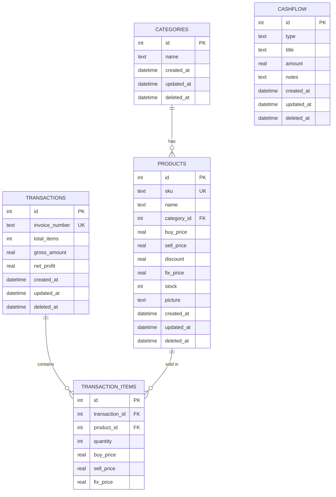

# Database Schema — POS PowerPlay

## Entity Relationship Diagram (ERD)



---

## Tabel Detail

### 1. `categories`
| Kolom | Tipe | Keterangan |
|---|---|---|
| `id` | INTEGER PK AUTOINCREMENT | ID unik |
| `name` | TEXT NOT NULL | Nama kategori |
| `created_at` | DATETIME | Waktu dibuat |
| `updated_at` | DATETIME | Waktu terakhir diperbarui |
| `deleted_at` | DATETIME NULL | NULL = aktif, diisi = soft-deleted |

### 2. `products`
| Kolom | Tipe | Keterangan |
|---|---|---|
| `id` | INTEGER PK AUTOINCREMENT | ID unik |
| `sku` | TEXT UNIQUE NOT NULL | Kode produk (barcode) |
| `name` | TEXT NOT NULL | Nama produk |
| `category_id` | INTEGER FK → categories.id | Kategori (nullable) |
| `buy_price` | REAL NOT NULL | Harga beli (HPP) |
| `sell_price` | REAL NOT NULL | Harga jual normal |
| `discount` | REAL DEFAULT 0 | Nominal diskon |
| `fix_price` | REAL NOT NULL | Harga jual final = sell_price - discount |
| `stock` | INTEGER DEFAULT 0 | Jumlah stok tersedia |
| `picture` | TEXT NULL | URI gambar produk |
| `created_at` | DATETIME | Waktu dibuat |
| `updated_at` | DATETIME | Diperbarui setiap ada perubahan |
| `deleted_at` | DATETIME NULL | Soft delete timestamp |

### 3. `transactions`
| Kolom | Tipe | Keterangan |
|---|---|---|
| `id` | INTEGER PK AUTOINCREMENT | ID unik |
| `invoice_number` | TEXT UNIQUE NOT NULL | No. nota: INV-YYYYMMDD-XXXXX |
| `total_items` | INTEGER NOT NULL | Total item terjual |
| `gross_amount` | REAL NOT NULL | Total pendapatan (Σ fix_price × qty) |
| `net_profit` | REAL NOT NULL | Laba bersih dari penjualan |
| `created_at` | DATETIME | Waktu transaksi |
| `updated_at` | DATETIME | Diperbarui saat void/restore |
| `deleted_at` | DATETIME NULL | NULL = aktif, diisi = VOID |

### 4. `transaction_items`
| Kolom | Tipe | Keterangan |
|---|---|---|
| `id` | INTEGER PK AUTOINCREMENT | ID unik |
| `transaction_id` | INTEGER FK → transactions.id CASCADE | Induk transaksi |
| `product_id` | INTEGER FK → products.id SET NULL | Produk (nullable jika dihapus) |
| `quantity` | INTEGER NOT NULL | Jumlah dibeli |
| `buy_price` | REAL NOT NULL | Snapshot HPP saat transaksi |
| `sell_price` | REAL NOT NULL | Snapshot harga jual saat transaksi |
| `fix_price` | REAL NOT NULL | Snapshot harga final saat transaksi |

> ⚠️ Harga di `transaction_items` adalah **snapshot** — tidak berubah jika harga produk diubah kemudian.

### 5. `cashflow`
| Kolom | Tipe | Keterangan |
|---|---|---|
| `id` | INTEGER PK AUTOINCREMENT | ID unik |
| `type` | TEXT CHECK IN ('INCOME','EXPENSE') | Jenis arus kas |
| `title` | TEXT NOT NULL | Keterangan |
| `amount` | REAL NOT NULL | Jumlah rupiah |
| `notes` | TEXT NULL | Catatan tambahan |
| `created_at` | DATETIME | Waktu dicatat |
| `updated_at` | DATETIME | Diperbarui saat edit |
| `deleted_at` | DATETIME NULL | Soft delete timestamp |

---

## Indexes

```sql
-- Partial indexes untuk performa filter aktif
CREATE INDEX idx_products_active ON products(id) WHERE deleted_at IS NULL;
CREATE INDEX idx_products_sku_active ON products(sku) WHERE deleted_at IS NULL;
CREATE INDEX idx_transactions_active ON transactions(id) WHERE deleted_at IS NULL;
CREATE INDEX idx_cashflow_active ON cashflow(id) WHERE deleted_at IS NULL;
CREATE INDEX idx_transaction_items_txn ON transaction_items(transaction_id);
```

---

## Kalkulasi KPI Dashboard

```sql
-- Laba Kotor (Gross Revenue)
SELECT SUM(gross_amount) FROM transactions
WHERE deleted_at IS NULL AND DATE(created_at) BETWEEN ? AND ?;

-- Laba Bersih (Net Profit)
-- = (Sales net_profit) + INCOME cashflow - EXPENSE cashflow
SELECT SUM(net_profit) FROM transactions WHERE deleted_at IS NULL;
SELECT SUM(amount) FROM cashflow WHERE deleted_at IS NULL AND type = 'INCOME';
SELECT SUM(amount) FROM cashflow WHERE deleted_at IS NULL AND type = 'EXPENSE';

-- Nilai Aset
SELECT SUM(buy_price * stock) FROM products WHERE deleted_at IS NULL;
```

---

## Soft Delete Business Logic

```
Hapus produk:
  UPDATE products SET deleted_at = NOW(), updated_at = NOW() WHERE id = ?

Restore produk:
  UPDATE products SET deleted_at = NULL, updated_at = NOW() WHERE id = ?

Void transaksi (KRITIS — cascade ke stok):
  1. UPDATE transactions SET deleted_at = NOW(), updated_at = NOW() WHERE id = ?
  2. FOR EACH item IN transaction_items WHERE transaction_id = ?:
       UPDATE products SET stock = stock + item.quantity, updated_at = NOW() WHERE id = item.product_id
```
